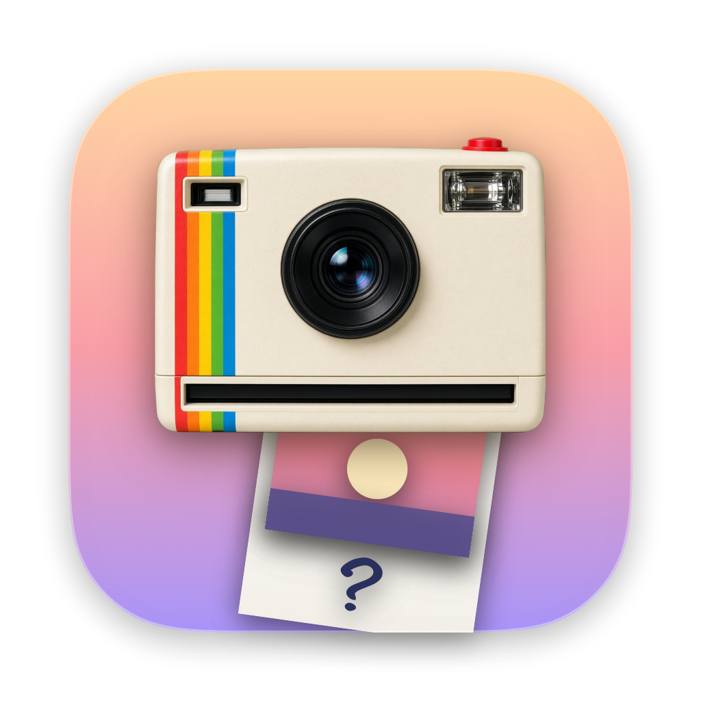
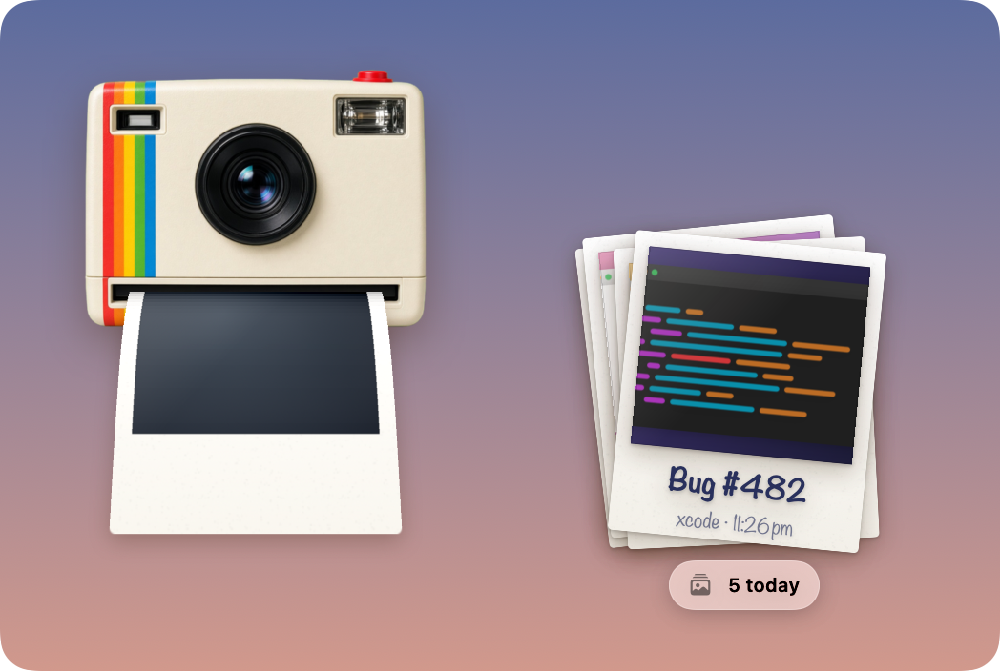
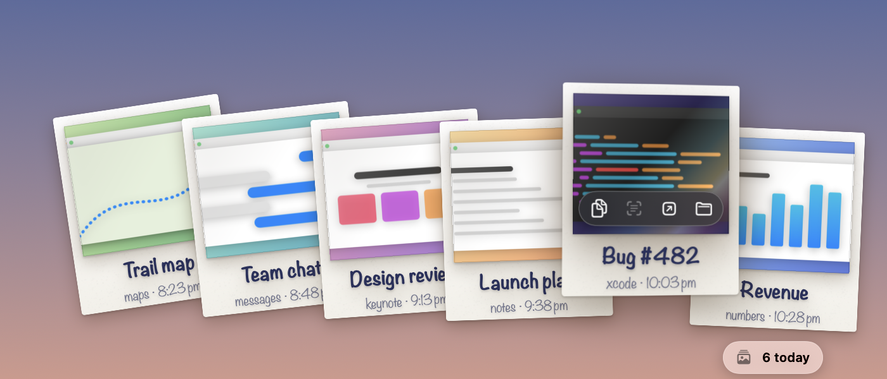
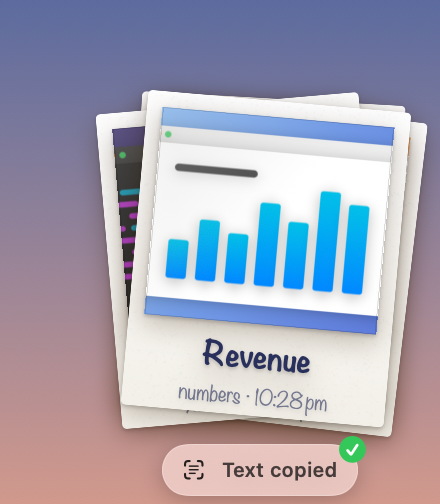
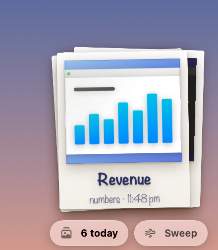
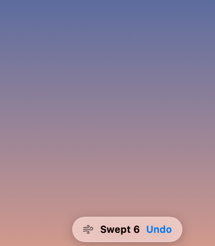
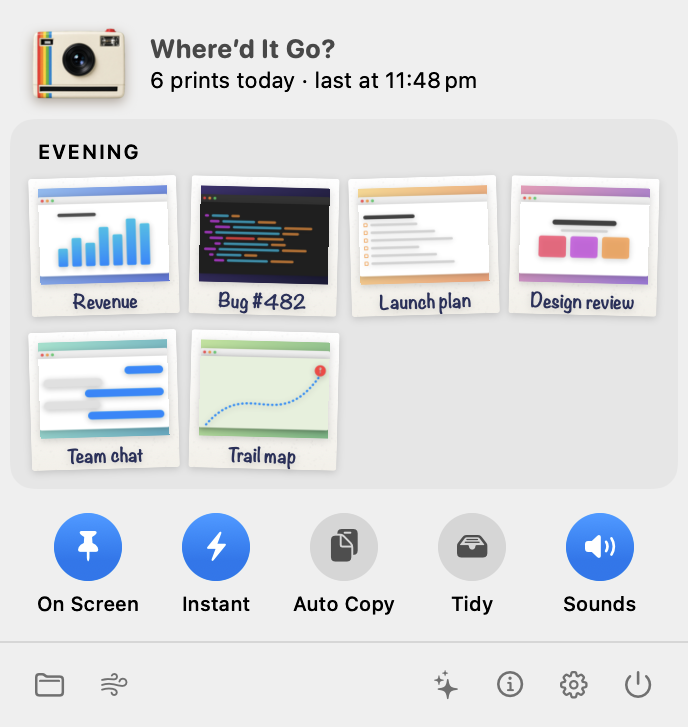
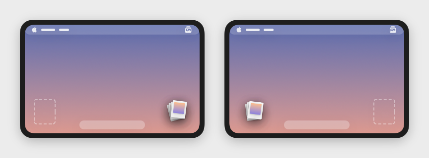
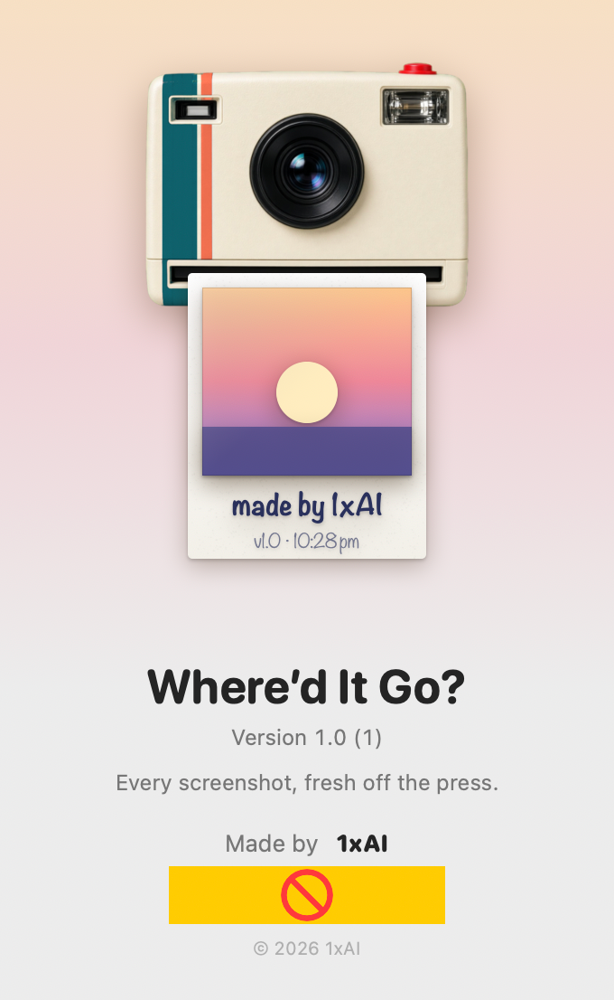

<p align="center">
  
</p>

<h1 align="center">Where’d It Go?</h1>

<p align="center">
  Every screenshot, printed into a little pile in the corner of your screen.<br>
  A tiny instant camera for your Mac menu bar.
</p>

<p align="center">
  <a href="https://1xaispark.com/apps/wherediditgo.html">Website</a> ·
  macOS 14 Sonoma or later · Free and open source (MIT)
</p>

---

You take a screenshot, the little preview vanishes before you can drag it anywhere, and the file lands somewhere on a Desktop full of `Screenshot 2026-10-08 at 5.41.12 PM.png`. Which one was it?

**Where’d It Go?** keeps today’s screenshots right where you can grab them. Each new screenshot is printed by an instant camera in the corner of your screen, develops like a Polaroid, and drops onto a pile. Drag any print straight into Slack, Mail, Figma, or Finder.

<p align="center">
  
</p>

## Features

### Printing

- **Prints like real instant film.** Take a screenshot and the camera pops up in the corner. The print feeds out of the slot over a couple of seconds, curling toward you as it sags under its own weight, then drops flat and starts to develop.
- **Shake it.** Wiggle the pointer over a developing print to speed it up, like shaking a Polaroid. You can also drag it away before it’s done.
- **A camera with a little personality.** The lens follows your pointer around the screen, and the camera gives a happy hop when a print lands.
- **Handwritten captions.** On-device text recognition writes each print’s most prominent words on it, so you can tell prints apart at a glance. Nothing leaves your Mac.

### The pile

- **Fan it out.** Hover the pile and it spreads into a hand of cards, newest first. The card under your pointer lifts, tilts toward you, and catches a foil-like shine as you move across it.
- **Controls on the print.** The lifted print shows four buttons: **Copy Picture**, **Copy Text** (every line of text recognized in the screenshot), **Open**, and **Show in Finder**. A small “Picture copied” or “Text copied” note confirms under the pile.
- **Drag, click, right-click.** Drag a print into any app, double-click to open it, or right-click for the same actions plus **Remove from Pile** and **Move to Trash**.
- **Sweep it away.** Hover the pile and click **Sweep** to flick every print off with a swish and a poof. Changed your mind? **Undo** puts them back. Your files are never touched.

<p align="center">
  
</p>

<p align="center">
  
  &nbsp;&nbsp;
  
  &nbsp;&nbsp;
  
</p>

### Menu bar

Click the photo-stack icon in the menu bar to open a small panel:

- **Today’s contact sheet.** Today’s prints as mini Polaroids, grouped into morning, afternoon, and evening. Click one to open it, drag it into any app, or right-click to copy it, copy its text, or show it in Finder. With nothing printed yet, the panel shows the screenshot shortcuts instead.
- **Quick switches.** Round toggles for **On Screen** (keep the pile visible), **Instant** (skip the five-second macOS thumbnail delay), **Auto Copy** (put every new screenshot on the clipboard), **Tidy** (file screenshots under `Pictures/Where’d It Go/<date>`), and **Sounds**.
- **Everything else, one click away.** Open the screenshots folder, sweep the pile, replay the welcome tour, and open About, Settings, or Quit.

<p align="center">
  
</p>

### Settings and About

- **Pick your corner.** Click a corner of a tiny Mac screen to send the pile there, and watch the pile’s size change as you adjust it.
- **About, printed.** The About window’s camera prints its own credits. Click the camera to take another, and it reprints your recent screenshots.
- **Respects your setup.** Follows the screenshot location you chose in the Screenshot app and supports launch at login. Sounds are subtle and can be turned off. With Reduce Motion on, prints fade in instead of feeding out. VoiceOver reads each print’s caption and the text inside it.

<p align="center">
  
</p>

<p align="center">
  
</p>

## Install

1. Download **[WheredItGo.zip](https://github.com/deepujain/whereditgo/releases/latest/download/WheredItGo.zip)** (macOS 14 or later, Apple silicon and Intel).
2. Open the zip and drag **Where’d It Go.app** into your **Applications** folder.
3. Open it. The app isn’t notarized by Apple yet, so the first time macOS says it can’t verify the developer. Open **System Settings › Privacy & Security**, scroll down, and click **Open Anyway**. You only need to do this once.

A photo-stack icon appears in the menu bar; click it to see today’s prints and switches. macOS then asks for permission to read your Desktop (or wherever your screenshots are saved). That’s the only access it needs.

**Tip:** macOS holds each screenshot back for about five seconds while it shows its own floating thumbnail. Turn on the **Instant** switch in the menu bar panel (or use the welcome tour or **Settings › Speed**) so prints appear right away.

## Build from source

Requires macOS 14 or later and Swift 6 (Xcode or the Command Line Tools).

```sh
git clone https://github.com/deepujain/whereditgo.git
cd whereditgo
./build.sh
```

This builds a release binary, assembles `build/Where'd It Go.app` with its icon, and signs it for local use. Run `./build.sh debug` for a debug build, or `./package.sh` to produce the downloadable `build/WheredItGo.zip`.

## How it works

- Watches your screenshot folder (read from the `com.apple.screencapture` preferences) with a lightweight file-system watcher.
- Recognizes screenshots by the `kMDItemIsScreenCapture` metadata macOS attaches to them, so other files in the folder are ignored.
- Shows the camera and pile in a borderless, non-activating panel that’s sized to exactly what’s on screen, so it never steals focus or blocks clicks elsewhere.
- Built with SwiftUI and AppKit. No dependencies, no network access, no analytics.

## Project layout

```
Sources/WheredItGo/
  App/       App entry point, the floating panel, the app icon artwork
  Model/     The desk model (watching, printing, the pile) and screenshot items
  Views/     Camera, Polaroid, pile, menu, settings, and welcome views
  Support/   Preferences, screenshot folder helpers, and sounds
  Debug/     Debug-only snapshot renderer for reviewing the UI
Resources/   Info.plist and the camera photo
build.sh     Builds and signs the .app
package.sh   Builds the downloadable zip
```

## License

MIT © 2026 1xAI. See [LICENSE](LICENSE).
